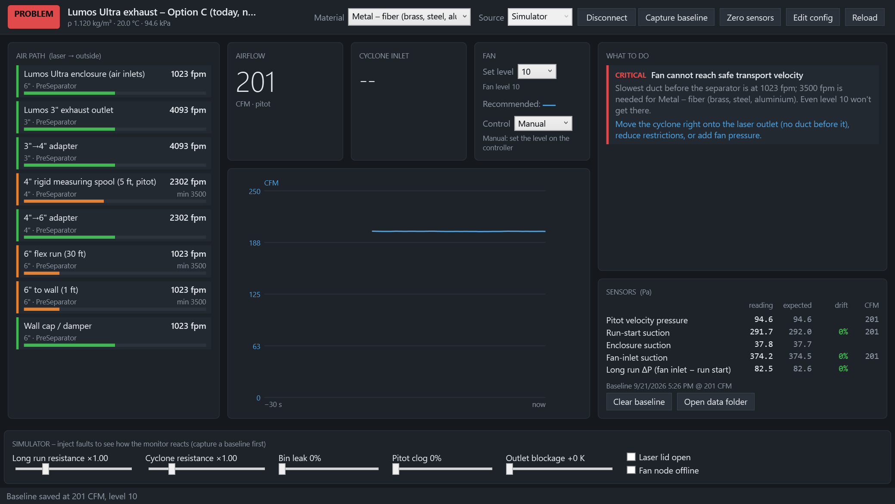

# Lumos Ultra Exhaust Monitor (LumosAir)

Cheap, fully local airflow monitoring for a laser-engraver exhaust. Two identical boxes — an ESP32 running MicroPython, pressure sensors and a 2" colour display — feed a Windows app. The app shows live CFM and duct air speeds, sets or recommends the fan level, and diagnoses problems:

- a clogged or kinked duct
- leaking joints
- a leaking dust bin
- a clogged pitot tube
- a blocked outside vent
- a laser enclosure that isn't under enough suction

It was built for a **WeCreat Lumos Ultra** (fiber/UV) venting through an **AC Infinity CLOUDLINE S6**. Everything, including the duct path, fan curve and sensor map, is set in a JSON file, so it adapts to other lasers and fans.

The exhaust run itself is ordinary 4" and 6" **flexible** duct and stays that way. The one exception is a 5 ft **rigid 4" measuring spool** holding a Dwyer 166-6-CF pitot-static probe: flex duct has corrugations, a vague inside diameter and a centreline that shifts when the hose moves, so the flow measurement everything else is checked against gets one stable, known-geometry station. [DESIGN.md §2–3](docs/DESIGN.md) covers the spool, the probe and the traverse.


---

## Why this is being built *before* the cyclone separator

Deep brass engraving produces real, heavy metal particulate, not just smoke. A temporary 35 ft exhaust hose came out with a pile of brass in it. The plan is to put a **cyclone separator right at the laser outlet** so the brass drops into a sealed drum before it reaches the long duct and the fan.

Cyclones are finicky. They only separate well within a band of airflow, and they use up a lot of the fan's pressure. Choosing one without measuring is guesswork. **The monitor comes first because it answers the questions that decide which separator to buy.**

1. **How much air does the existing system really move?**
   - The S6 is rated 425 CFM, but that is with nothing attached.
   - With the Lumos outlet, adapters, 30 ft of flex and a wall cap, the real figure is much lower.
   - The monitor measures it at every fan level.
2. **Can the fan drive a given cyclone?**
   - The popular 3" steel Dust Deputy needs at least 200 CFM. The physics model estimates that would take roughly 3.4–9 inWC across the cyclone alone.
   - The S6 makes about 2 inWC with no airflow at all. The model predicts only 80–120 CFM with that cyclone.
   - Once the real fan curve is measured, `lumosair model` gives a measured-model answer for any candidate cyclone before you spend ~$400. See [DESIGN.md §1](docs/DESIGN.md#1-key-findings-read-this-first).
3. **Is brass settling in the duct right now?**
   - Air speed in each section is compared with the speed needed to keep metal particles airborne (~3,500 fpm).
   - Modelled as it stands today (`lumosair init --option C`), the system moves about 200 CFM at level 10: ~2,300 fpm in the 4" section and ~1,020 fpm in the 6" run. Both are below what brass needs, so the duct is currently acting as the separator — which matches the brass found in the old hose.
   - No fan level fixes that, which is the argument for a separator at the laser rather than more fan speed.
4. **Once a separator is installed, is it working?**
   - The monitor tracks cyclone pressure drop, dust-bin suction (a leaking bin stops separation), inlet velocity and estimated cut size.
   - It compares them all against a "known good" baseline.

In short: **measure first, then size the separator to the air you actually have**, and keep the same sensors in place to watch it afterwards.

---

## Screenshots

These come from the built-in simulator (`LumosAir.exe --selftest out.png --scenario <name>`), so you can explore the app before any hardware exists.

**The system as it stands today (Option C, no separator).** Every duct is on the dirty side, and none of them is fast enough to carry brass — no fan level fixes it, which is the case for a separator at the laser:



| Healthy system (Option A, with a separator) | Fan turned down too far |
|---|---|
|  |  |
| **Clogged pitot tube** (app switches to the other sensors) | **Blocked outside vent / damper** |
|  |  |

System layout and sensor taps:


---

## Cost per sensor unit

Approximate prices as of September 2026; check before ordering. The full list is in [`docs/BOM.csv`](docs/BOM.csv).

### Per measurement channel

| Channel type | Parts | Approx. cost |
|---|---|---|
| **Precision differential channel** (cyclone ΔP, enclosure) | Sensirion SDP810-500Pa + tubing + 2 wall taps | **$38–55** |
| **Pitot flow channel** (CFM) | SDP810-500Pa + Dwyer 166-6-CF pitot-static probe + 1/8" FNPT boss + tubing/adapters | **$210–295** |
| **High-suction static channel** (bin, run start, fan inlet) | CFSensor XGZP6897D ±1 kPa + tubing + wall tap | **$11–18** |
| Air-density channel (optional) | BME280 breakout | $5–10 |
| **Box** (either node) | Hammond 1554H2GYCL + 2.0" ST7789 display + 6 bulkheads + gland + standoffs | **$70–95** |

### Per node

| Node | Contents | Approx. cost |
|---|---|---|
| **Laser node** | ESP32, TCA9548A mux, BME280, 3× SDP810, 2× XGZP6897D, Dwyer pitot + boss, tubing, taps, box + display | **$400–560** |
| **Fan node** | ESP32, 1× XGZP6897D, tap, box + display | **$95–125** |
| **Complete system** (excluding the separator) | both nodes + the 5 ft rigid 4" measuring spool | **≈ $520–700** |
| **Measure-first starter kit** | fan node + an ESP32 with only the pitot channel and the rigid spool | **≈ $370–470** |

The Dwyer 166-6-CF pitot ($160–220 new) is most of the difference. It earns its place: its ASHRAE tip needs no calibration (coefficient 1.000), and at 1/8" it is one of the few probes Dwyer rates for a duct as small as 4". A generic probe is cheaper but has an unknown coefficient, so it has to be calibrated against something else.

---

## The boxes

Both nodes use the **same enclosure with the same bulkhead pattern** (Hammond
1554H2GYCL, clear lid); the fan box plugs the ports it doesn't use. The fitment
model is a CadQuery script, so the STEP, STL, drawings, 1:1 drill template and the
clearance report are all generated from one source — see [`cad/`](cad/).


Because the lid is clear polycarbonate, the 2" display needs no cut-out: it sits on
standoffs and reads through the lid, and the box stays sealed. The screen shows the
status colour, system CFM, fan level and mode, the top finding, and every channel on
that node — and keeps showing live pressures if the PC app isn't running.

## Fan control: automatic or manual

The app's fan card has a **Control** selector:

- **Manual** — it recommends a level and you set the dial; nothing is ever sent.
- **Auto** — it sends the level to the fan node. Raising speed happens immediately
  (and a critical finding pins the fan at maximum); easing back only happens after
  the lower recommendation has held for the dwell time, so the fan doesn't hunt.

The fan node's output pin stays disabled until you verify the CLOUDLINE UIS pinout
yourself — until then Auto still works as an advisory, on screen and on the box.

## Repository layout

```
cad/         parametric enclosure fitment model (CadQuery) + generated STEP/STL/views
docs/        DESIGN.md (start here), BOM.csv, system diagram, screenshots, model output
firmware/micropython/   ESP32 node firmware: sensors, display, Wi-Fi, OTA
app/
  src/LumosAir.Core      physics model, diagnostics, UDP / MQTT / simulator (no NuGet dependencies)
  src/LumosAir.Desktop   WPF monitor app
  src/LumosAir.Cli       `lumosair` CLI: model / simulate / listen
  tests/LumosAir.Tests   dependency-free test runner (41 tests)
  config/                sample system.json (Option A / B, and C = today's system)
```

## Desktop app (Windows, .NET 9)

```powershell
cd app
dotnet run --project src/LumosAir.Desktop                       # the monitor
dotnet run --project tests/LumosAir.Tests                       # tests
dotnet run --project src/LumosAir.Cli -- model --option C        # the system as it is today
dotnet run --project src/LumosAir.Cli -- model --need-cfm 200   # "can my fan do this?"
```

- **First run:** the app writes `%APPDATA%\LumosAir\system.json`. Use **Edit config**, then **Reload**. Start it with `--config path\to\system.json` to use a different one (e.g. `app/config/system.optionC.json`).
- **No hardware yet:** set **Source** to **Simulator**, click **Connect**, then **Capture baseline**, and use the sliders to inject faults.
- **Real nodes:** use **Udp** (no setup needed) or **Mqtt** (e.g. the Home Assistant Mosquitto add-on). Set **Set level** to match the fan controller.
- **Logs:** a CSV row is written to `%APPDATA%\LumosAir\` every 5 s.
- **Other SDKs:** add `-p:AppTfm=net8.0` or `-p:AppTfm=net10.0`.

## Firmware (MicroPython on ESP32)

Developed in VS Code with the MicroPico extension — full details in
[`firmware/micropython/README.md`](firmware/micropython/README.md).

1. Flash MicroPython once over USB (`esptool`).
2. Copy `config_example.py` to `config.py`: Wi-Fi, node id, channel map, pins.
3. Upload with MicroPico or `mpremote fs cp -r lib : && mpremote fs cp main.py config.py :`.

After that the boxes update over Wi-Fi — no cable, no taking them off the duct:

```
python tools/serve_update.py               # on the PC
python tools/send_command.py laser update  # or the app
```

The node fetches a manifest, downloads only the files whose SHA-256 changed, and
reboots. It reads the sensors through a TCA9548A multiplexer, publishes JSON over
UDP and/or MQTT, drives the display, and accepts `zero`, `clear_zero`, `set_level`,
`info`, `update` and `reboot`.

Host tests (no hardware needed): `python firmware/micropython/tests/test_firmware.py` — 31 checks.

### Telemetry format

UDP port 47810, or MQTT topic `lumosair/<node>/telemetry`:

```json
{"node":"laser","seq":12,"up":3456,"rssi":-61,
 "ch":{"cyc_dp":{"pa":212.4,"t":24.1,"ok":true},"pitot":{"pa":46.8,"t":24.0,"ok":true}},
 "env":{"t":23.9,"rh":41.0,"p":94412}}
```

Commands go to UDP port 47811 or `lumosair/<node>/cmd`, e.g. `{"cmd":"zero"}`.

## Status

- **Working and tested:** the physics model, the diagnostics (all 9 simulated faults detected, no false alarms), automatic fan control, the desktop app and the CLI. 41 app tests plus 31 firmware tests, all on the PC.
- **Firmware:** MicroPython, driver maths and payloads unit-tested on the PC, not yet run on hardware.
- **Fan output pin:** disabled until the CLOUDLINE UIS pinout is verified; Auto mode is advisory until then.
- **Needs calibration:** the fan curve, cyclone loss coefficient and pitot profile factor are estimates until they are measured on the real system. [DESIGN.md §6](docs/DESIGN.md#6-commissioning) walks through calibrating them.

## Safety note

Brass dust contains copper and zinc. Don't blow accumulated dust out of ducts with compressed air. Keep the dirty side of the system short, smooth, metal and grounded. This project monitors airflow; it is not a certified safety device.

## License

MIT. See [LICENSE](LICENSE).
