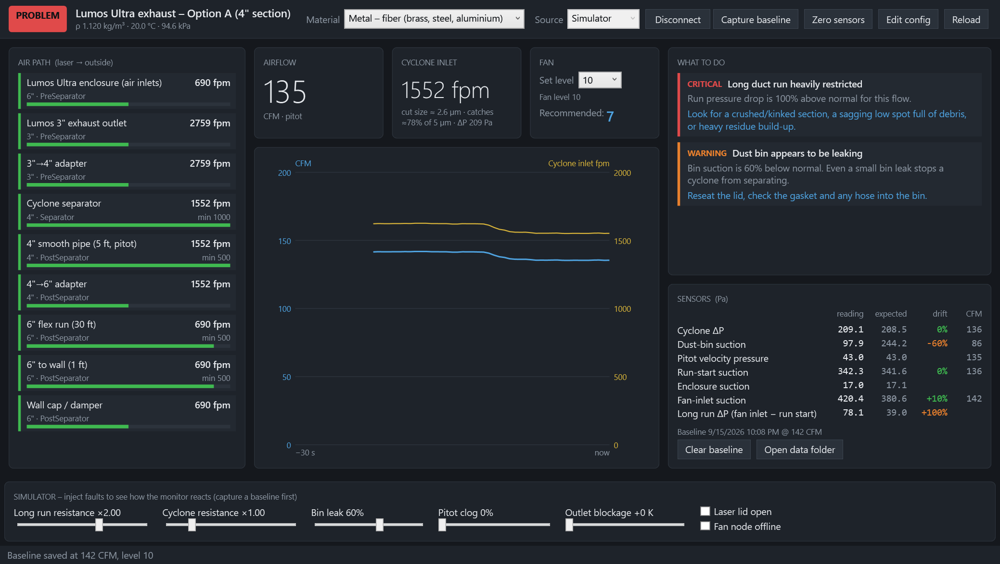
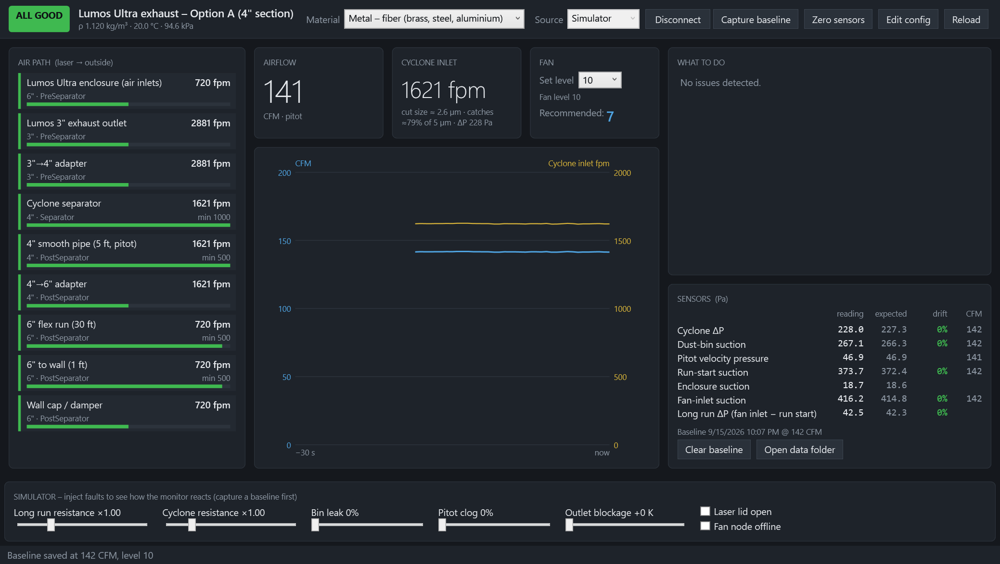
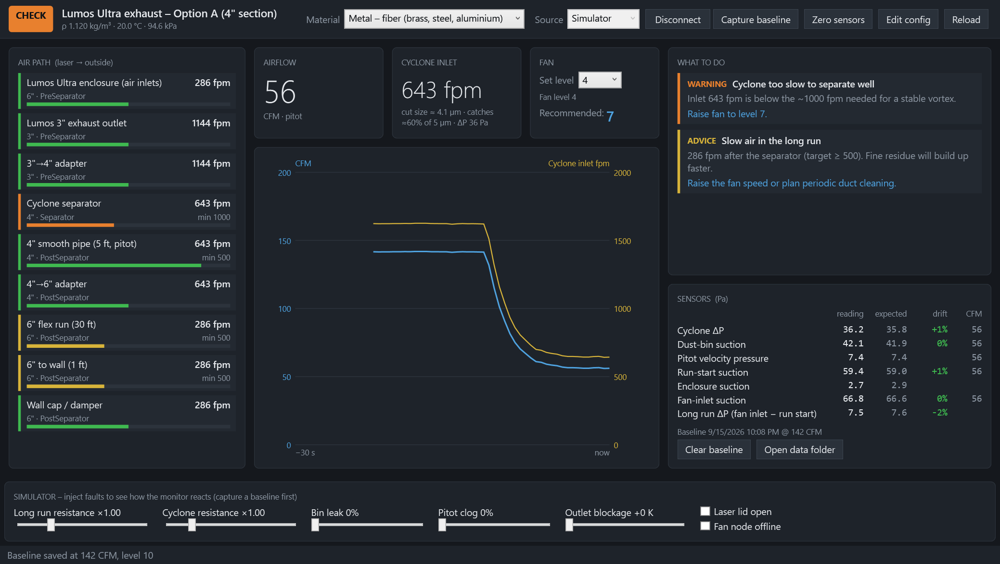
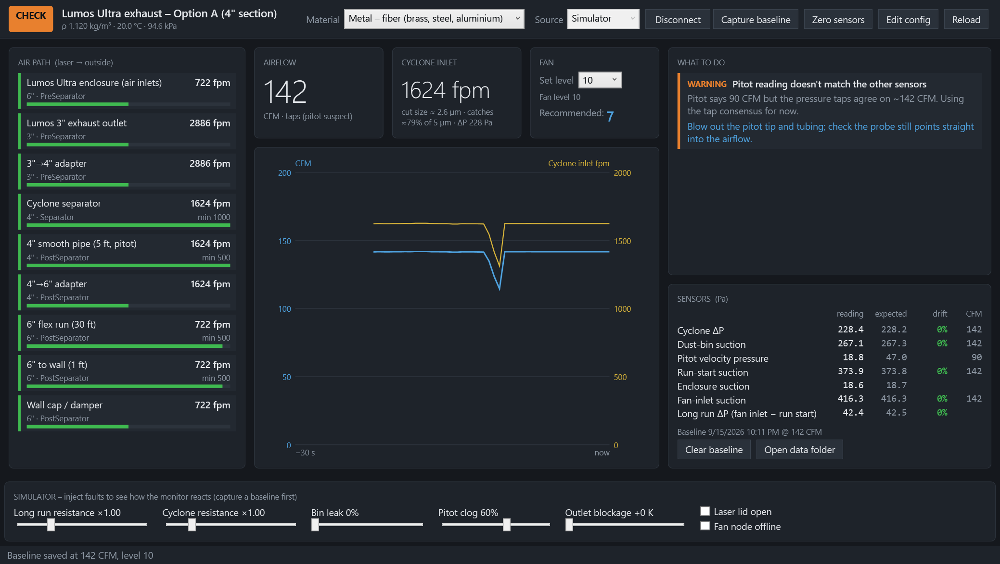
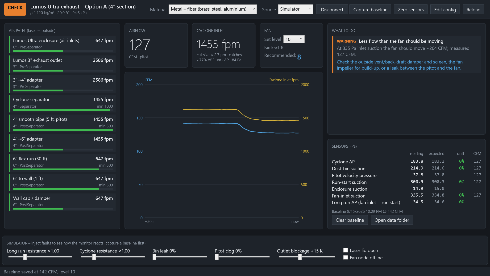

# Lumos Ultra Exhaust Monitor (LumosAir)

Cheap, fully local airflow monitoring for a laser-engraver exhaust. Differential-pressure sensors on two ESP32 boards feed a Windows app. The app shows live CFM and duct air speeds, tells you which fan level to use, and diagnoses problems:

- a clogged or kinked duct
- leaking joints
- a leaking dust bin
- a clogged pitot tube
- a blocked outside vent
- a laser enclosure that isn't under enough suction

It was built for a **WeCreat Lumos Ultra** (fiber/UV) venting through an **AC Infinity CLOUDLINE S6**. Everything, including the duct path, fan curve and sensor map, is set in a JSON file, so it adapts to other lasers and fans.



---

## Why this is being built *before* the cyclone separator

Deep brass engraving produces real, heavy metal particulate, not just smoke. A temporary 35 ft exhaust hose came out with a pile of brass in it. The plan is to put a **cyclone separator right at the laser outlet** so the brass drops into a sealed drum before it reaches the long duct and the fan.

Cyclones are finicky. They only separate well within a band of airflow, and they use up a lot of the fan's pressure. Choosing one without measuring is guesswork. **The monitor comes first because it answers the questions that decide which separator to buy.**

1. **How much air does the existing system really move?**
   - The S6 is rated 425 CFM, but that is with nothing attached.
   - With the Lumos outlet, adapters, 30 ft of flex and a wall cap, the real figure is much lower.
   - The monitor measures it at every fan level.
2. **Can the fan drive a given cyclone?**
   - The popular 3" steel Dust Deputy needs at least 200 CFM. The physics model estimates that would take roughly 3.4–9 inWC across the cyclone alone.
   - The S6 makes about 2 inWC with no airflow at all. The model predicts only 80–120 CFM with that cyclone.
   - Once the real fan curve is measured, `lumosair model` gives a measured-model answer for any candidate cyclone before you spend ~$400. See [DESIGN.md §1](docs/DESIGN.md#1-key-findings-read-this-first).
3. **Is brass settling in the duct right now?**
   - Air speed in each section is compared with the speed needed to keep metal particles airborne (~3,500 fpm).
   - With the S6, the 6" run is far below that. That is why the separator has to sit *before* the long run, with almost no duct ahead of it.
4. **Once a separator is installed, is it working?**
   - The monitor tracks cyclone pressure drop, dust-bin suction (a leaking bin stops separation), inlet velocity and estimated cut size.
   - It compares them all against a "known good" baseline.

In short: **measure first, then size the separator to the air you actually have**, and keep the same sensors in place to watch it afterwards.

---

## Screenshots

These come from the built-in simulator (`LumosAir.exe --selftest out.png --scenario <name>`), so you can explore the app before any hardware exists.

| Healthy system | Fan turned down too far |
|---|---|
|  |  |
| **Clogged pitot tube** (app switches to the other sensors) | **Blocked outside vent / damper** |
|  |  |

System layout and sensor taps:


---

## Cost per sensor unit

Approximate prices as of September 2026; check before ordering. The full list is in [`docs/BOM.csv`](docs/BOM.csv).

### Per measurement channel

| Channel type | Parts | Approx. cost |
|---|---|---|
| **Precision differential channel** (cyclone ΔP, enclosure) | Sensirion SDP810-500Pa + tubing + 2 wall taps | **$38–55** |
| **Pitot flow channel** (CFM) | SDP810-500Pa + pitot-static probe + tubing | **$60–130** |
| **High-suction static channel** (bin, run start, fan inlet) | CFSensor XGZP6897D ±1 kPa + tubing + wall tap | **$11–18** |
| Air-density channel (optional) | BME280 breakout | $5–10 |

### Per node

| Node | Contents | Approx. cost |
|---|---|---|
| **Laser node** | ESP32, TCA9548A mux, BME280, 3× SDP810, 2× XGZP6897D, pitot probe, tubing, taps, enclosure, USB supply | **$195–320** |
| **Fan node** | ESP32, 1× XGZP6897D, tap, enclosure, USB supply | **$35–50** |
| **Complete system** (excluding the separator) | both nodes + 5 ft of smooth 4" pipe | **≈ $250–400** |
| **Measure-first starter kit** | fan node + an ESP32 with just the pitot channel | **≈ $110–190** |

---

## Repository layout

```
docs/        DESIGN.md (start here), BOM.csv, system diagram, screenshots, model output
firmware/    ESP32 PlatformIO project: laser node + fan node
app/
  src/LumosAir.Core      physics model, diagnostics, UDP / MQTT / simulator (no NuGet dependencies)
  src/LumosAir.Desktop   WPF monitor app
  src/LumosAir.Cli       `lumosair` CLI: model / simulate / listen
  tests/LumosAir.Tests   dependency-free test runner (30 tests)
  config/                sample system.json (Option A / Option B layouts)
```

## Desktop app (Windows, .NET 9)

```powershell
cd app
dotnet run --project src/LumosAir.Desktop                       # the monitor
dotnet run --project tests/LumosAir.Tests                       # tests
dotnet run --project src/LumosAir.Cli -- model --need-cfm 200   # "can my fan do this?"
```

- **First run:** the app writes `%APPDATA%\LumosAir\system.json`. Use **Edit config**, then **Reload**.
- **No hardware yet:** set **Source** to **Simulator**, click **Connect**, then **Capture baseline**, and use the sliders to inject faults.
- **Real nodes:** use **Udp** (no setup needed) or **Mqtt** (e.g. the Home Assistant Mosquitto add-on). Set **Set level** to match the fan controller.
- **Logs:** a CSV row is written to `%APPDATA%\LumosAir\` every 5 s.
- **Other SDKs:** add `-p:AppTfm=net8.0` or `-p:AppTfm=net10.0`.

## Firmware (ESP32)

1. Copy `firmware/include/lumosair_config.example.h` to `lumosair_config.h`. Set your Wi-Fi and check the sensor map. This file is git-ignored.
2. Flash each node:
   - `pio run -e laser -t upload`
   - `pio run -e fan -t upload`
3. Open the serial monitor at 115200 baud. Every channel should report `ok`.

The firmware compiles against the Arduino-ESP32 2.0.17 core. It reads the sensors through a TCA9548A multiplexer and publishes JSON over UDP broadcast and/or MQTT. It also accepts `zero`, `clear_zero`, `info` and `reboot` commands, and supports OTA updates.

### Telemetry format

UDP port 47810, or MQTT topic `lumosair/<node>/telemetry`:

```json
{"node":"laser","seq":12,"up":3456,"rssi":-61,
 "ch":{"cyc_dp":{"pa":212.4,"t":24.1,"ok":true},"pitot":{"pa":46.8,"t":24.0,"ok":true}},
 "env":{"t":23.9,"rh":41.0,"p":94412}}
```

Commands go to UDP port 47811 or `lumosair/<node>/cmd`, e.g. `{"cmd":"zero"}`.

## Status

- **Working and tested:** the physics model, the diagnostics (all 9 simulated faults detected, no false alarms), the desktop app and the CLI.
- **Firmware:** compile-verified, not yet run on hardware.
- **Needs calibration:** the fan curve, cyclone loss coefficient and pitot profile factor are estimates until they are measured on the real system. [DESIGN.md §6](docs/DESIGN.md#6-commissioning) walks through calibrating them.

## Safety note

Brass dust contains copper and zinc. Don't blow accumulated dust out of ducts with compressed air. Keep the dirty side of the system short, smooth, metal and grounded. This project monitors airflow; it is not a certified safety device.

## License

MIT. See [LICENSE](LICENSE).
