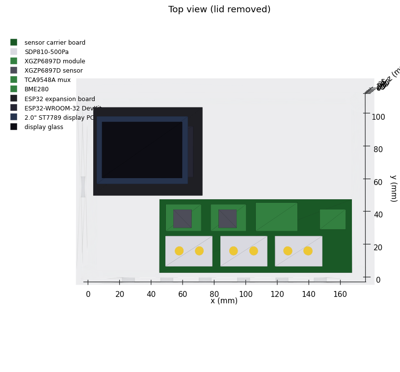

# Enclosure fitment model

Both nodes use the **same box with the same bulkhead pattern** — the fan box just
plugs the ports it doesn't use. The model is a script, so moving a part is a
one-line change and the drawings, the STEP file and the clearance report all
follow.

```
pip install cadquery matplotlib
python cad/enclosure.py                  # STEP + STL + SVG views + fitment report
python cad/enclosure.py --populate fan   # the fan box's population
python cad/render.py                     # shaded PNGs for the docs
```

Everything lands in `cad/out/`:

| File | What it's for |
|---|---|
| `lumosair_enclosure_laser.step` | open in FreeCAD / Fusion / SolidWorks |
| `lumosair_enclosure_laser.stl` | Blender, Bambu Studio, a quick print |
| `render_iso.png`, `render_top.png`, `render_front.png` | the pictures in the docs |
| `view_iso.svg`, `view_top.svg`, `view_front.svg` | vector line views |
| `drill_template_side.svg` | 1:1 hole pattern for the port wall |
| `fitment_report.txt` | part positions, clearances, collisions |



## The box

Hammond **1554H2GYCL**: 180 × 120 × 60.5 mm outside, 172.9 × 108.9 × 54.5 inside,
3 mm walls, **clear polycarbonate lid**. The clear lid is the reason the display
needs no cut-out — it sits on standoffs facing up and reads through the lid, which
keeps the box sealed.

## Layout

| Zone | Contents | Height above the inside floor |
|---|---|---|
| Port wall (y ≈ 0) | 6 × Ø8 mm bulkheads at 24 mm pitch, 14 mm up | — |
| Lower deck | sensor carrier on 16 mm standoffs; SDP810 barbs hang 9.7 mm below it, so tubing runs underneath | 16 → 28 mm |
| Same deck, other end | ESP32 expansion board (68.6 × 53.4) on 6 mm standoffs | 6 → 28 mm |
| Upper deck | 2.0" display on 34 mm standoffs, facing the lid | 34 → 40 mm |

That leaves about 15 mm of headroom under the lid.

## Port assignments

Same holes in both boxes:

| Port | Laser box | Fan box |
|---|---|---|
| 1 | cyclone ΔP + | fan-inlet suction |
| 2 | cyclone ΔP − | plug |
| 3 | dust bin | plug |
| 4 | pitot total | plug |
| 5 | pitot static | plug |
| 6 | enclosure suction | plug |

A cable gland in the end wall takes the USB supply lead (and, on the fan box, the
fan control lead if you enable it).

## Checking a change

`fitment_report.txt` lists every part's extent, the headroom, wall clearances and
any collisions. `enclosure.py` exits non-zero when something doesn't fit, so it
can sit in a build script.
