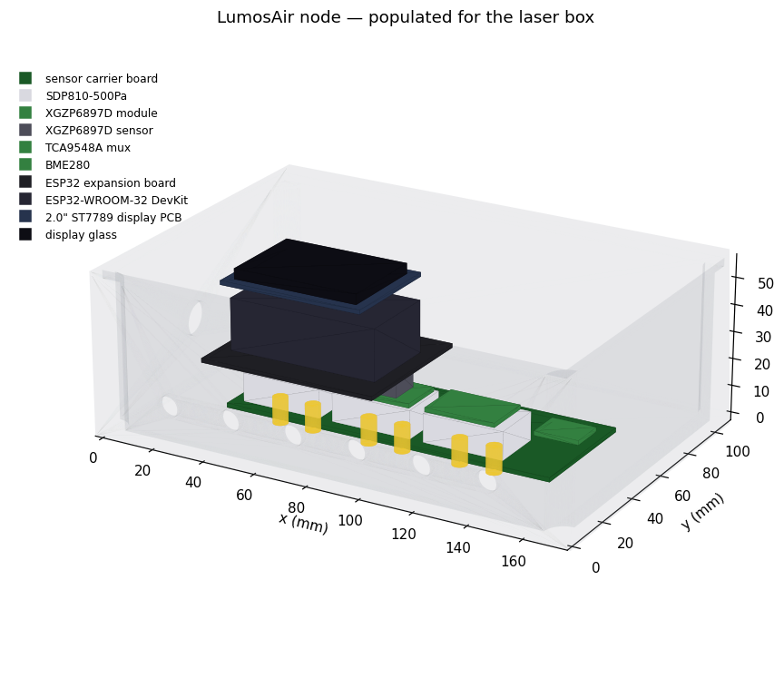
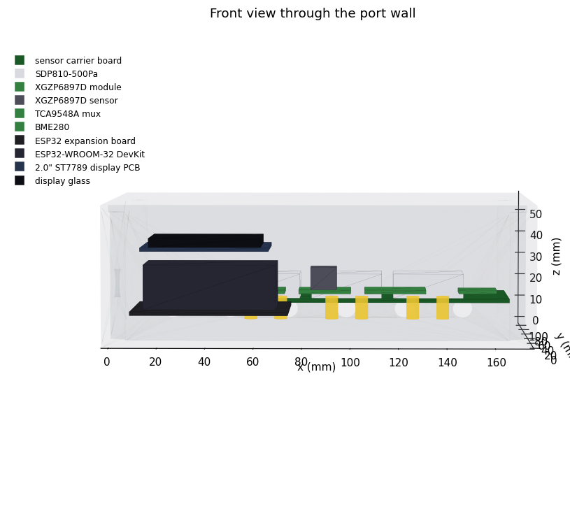
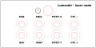

# LumosAir – Exhaust Airflow Monitor for the Lumos Ultra

*Design document, rev 4 — September 2026* (rev 2: named the pitot probe, the rigid measuring spool vs. flex duct distinction, two-axis traverse, Option C. rev 3: identical enclosures with a fitment model, a display in each box, MicroPython firmware, and automatic fan control with manual override. rev 4: stacked two-board enclosure with the hose routing modelled, 90° elbows at the sensors, a smaller 120 × 90 mm box, a front-panel power button, and generated panel artwork and PCB outlines)

LumosAir is a low-cost, fully local system that measures airflow along the Lumos Ultra exhaust path and tells you when to raise the fan speed. It also flags a clogged duct, a leaking joint, a failing separator or a leaking dust bin. It has three parts:

1. **Sensor nodes**: two identical boxes, each an ESP32 running MicroPython with differential-pressure sensors on small tap holes, and a 2" colour display showing live readings.
2. **Transport**: UDP broadcast on the LAN (no setup), or MQTT so the readings can also go into Home Assistant. The PC broadcasts a status summary back, which is what the box displays show.
3. **LumosAir desktop app** (.NET / WPF). It holds a physics model of the duct path, shows live CFM and air speeds, diagnoses problems, and can drive the fan automatically or leave it to you. A built-in simulator lets you test all of this before any hardware exists.


---

## 1. Key findings (read this first)

The numbers below come from the model in `app/` (`lumosair model …`). Two inputs are **estimates**: the S6 fan curve (built from AC Infinity's published 425 CFM / 503 Pa end points) and the internal resistance of the Lumos. Treat the numbers as ±25 % until the sensors are installed and calibrated. The conclusions do not change within that range.

1. **The 3" steel Dust Deputy and the CLOUDLINE S6 are not a good match.** Oneida lists a **minimum of 200 CFM** for the Heavy-Duty 3" Dust Deputy. Pushing 200 CFM through a 2-7/8" cyclone inlet takes roughly **3.4–9 inWC across the cyclone alone** (range covers typical cyclone loss coefficients K = 3–8). The S6 tops out at about **2 inWC (503 Pa) with no airflow at all**. With that cyclone installed, the model predicts **80–120 CFM** at speed 10, well below Oneida's minimum. Getting 200 CFM through that cyclone would take a shop-vac or dust-collector class blower, not an inline fan.
   ```
   lumosair model --cyc-inlet 2.875 --cyc-k 4 --need-cfm 200
   → system needs 1525 Pa (6.1 inWC); fan gives 392 Pa → NOT ENOUGH
   ```
2. **Brass is much easier to separate than wood dust, so a low-velocity cyclone can still work well.** Cyclone cut size scales with 1/√(particle density), and brass is about 8.5 g/cm³. Even at a modest ~1,600 fpm inlet speed, a cyclone with a 4" inlet has an estimated 50 % cut size near **2.6 µm for brass** (7.5 µm for wood char). The better fit is a **larger-inlet, lower-pressure-drop cyclone** that the S6 can actually drive. Manufacturers' minimum-CFM ratings are written for wood dust; the monitor measures whether your cyclone is actually working.
3. **Put nothing but a short smooth adapter between the Lumos and the cyclone.** The 3" outlet runs at roughly 2,000–2,900 fpm with the S6. That is below the ~3,500 fpm needed to keep brass airborne. The only safe amount of duct before the separator is almost none, which matches the pile of brass found inside the old 35 ft temporary hose.
4. **After the cyclone, the 6" flex run is not the bottleneck.** It costs about 40 Pa when the flex is pulled taut and about 60 Pa if it sags (friction multiplier 1.5 → 4.0), which moves the operating point by only 143 → 139 CFM. The Lumos 3" outlet, the 3"→4" adapter and the cyclone cost about 320 Pa between them. Replacing the 6" flex with smooth pipe gains little; the cyclone choice matters far more.
5. **Measure flow in a rigid 4" spool (Option A), not in 6" (Option B), and never in flex.** At the same flow, a pitot tube in 4" pipe sees about 47 Pa versus about 10 Pa in 6", which gives five times the signal for the same sensor.
6. **Fan-inlet suction runs around 400 Pa**, close to the full scale of a 500 Pa sensor. Use ±1 kPa sensors for the high-suction taps (fan inlet, run start and bin) so that a clog does not push them off scale.

### Estimated operating points (Option A, generic 4" inlet cyclone, K = 6)

| S6 level | CFM | 3" outlet fpm | Cyclone inlet fpm | 4" fpm | 6" fpm | Cyclone ΔP | d50 brass | d50 wood |
|---|---|---|---|---|---|---|---|---|
| 4 | 56 | 1,143 | 643 | 643 | 286 | 36 Pa | 4.1 µm | 12.0 µm |
| 6 | 85 | 1,723 | 969 | 969 | 431 | 81 Pa | 3.3 µm | 9.8 µm |
| 8 | 113 | 2,303 | 1,295 | 1,295 | 576 | 146 Pa | 2.9 µm | 8.4 µm |
| 10 | 142 | 2,884 | 1,622 | 1,622 | 721 | 228 Pa | 2.6 µm | 7.5 µm |

The full tables are in `model-optionA.txt`, `model-optionB.txt` and `model-optionC.txt`.

### Today's system (Option C, no separator): the brass has nowhere to drop out

Modelled as it stands now — 3" outlet, 3"→4", ~5 ft of 4", 4"→6", 30 ft of 6" flex, S6, wall cap:

| S6 level | CFM | 3" outlet fpm | 4" fpm | 6" fpm |
|---|---|---|---|---|
| 6 | 120 | 2,437 | 1,371 | 609 |
| 8 | 160 | 3,264 | 1,836 | 816 |
| 10 | 201 | 4,092 | 2,302 | 1,023 |

Brass needs roughly 3,500 fpm to stay airborne. Even at level 10 the 4" section is at ~2,300 fpm and the 6" run at ~1,020 fpm, so **the duct itself is acting as the separator** — which is exactly what the brass pile in the old temporary hose showed. The monitor reports this as "fan cannot reach safe transport velocity", and no fan level fixes it. The fix is a separator at the laser, not more fan speed.

### Why the monitor is built before the separator

The separator is the expensive, hard-to-reverse decision, and every number that decides it (real CFM, available fan pressure, cyclone pressure drop) is currently an estimate. The sensors turn those estimates into measurements. They then stay in place to verify the separator once it is installed: cut size, bin leaks, and whether brass still reaches the long run.

Install the sensor nodes on the **current** system first (the pitot section and the fan-inlet tap are enough). Then:

- Record CFM at every S6 level.
- Replace the estimated fan curve in `system.json` with your measured one.
- Run `lumosair model --config system.json --cyc-inlet <in> --cyc-k <K> --need-cfm <x>` for each candidate cyclone.

The flow you would get with each cyclone becomes a measured-model prediction instead of a guess.

---

## 2. Physical layout

```
Lumos Ultra ─3"─► short smooth 3"→4" ─► CYCLONE ─► 5 ft RIGID 4" spool ─► 4"→6" ─► 30 ft 6" flex ─► S6 ─► 1 ft ─► wall cap
 [encl tap]                  [cyc in tap]  │  [cyc out tap]   [PITOT]          [run-start tap]    [fan-in tap]
                                           └─► sealed steel drum  [bin tap]
```

**Option A (recommended)** is shown above. **Option B** replaces the 4" spool with 5 ft of rigid 6" pipe right after the cyclone: it saves about 12 Pa but gives a much weaker pitot signal. **Option C** is the system as it stands today, with no separator (`lumosair init --option C`); use it to measure before buying anything.

### Flexible duct versus the one rigid section

The exhaust run is **4" and 6" flexible duct**, and it stays that way. The single exception is the **rigid measuring spool**: about 5 ft of smooth 4" galvanized pipe holding the pitot probe. It exists only to give one stable, known-geometry measuring station, and it is not representative of the rest of the ducting.

That matters because flex duct has corrugations that disturb the velocity profile, a less well defined inside diameter, and a centreline that moves when the hose is repositioned. A centreline reading taken in flex can be repeatable one day and wrong the next. Since the pitot is the primary CFM measurement that every other sensor is cross-checked against, its station is worth making rigid.

The model already treats the flex as flex: `flex: true` with a friction multiplier (`flexFactor`) of 2.5, roughly 2.5× the friction of smooth pipe. Use 1.5 if the run is pulled taut and 4.0 if it sags. The rigid spool is the only duct element modelled as smooth.

Everything before the cyclone is "dirty side" and must be short, smooth, metal and bonded to ground. The fan sits on the clean side.

---

## 3. What is measured, where, and why

| Channel | Node | Sensor | + port | − port | Tells you |
|---|---|---|---|---|---|
| `cyc_dp` | laser | SDP810-500Pa | cyclone inlet wall tap | cyclone outlet wall tap | Cyclone restriction. Also a second flow meter once calibrated (ΔP ∝ Q²). |
| `bin` | laser | XGZP6897D ±1 kPa | room | tap in drum lid | **Bin leaks.** A leaking bin stops a cyclone from separating. |
| `pitot` | laser | SDP810-500Pa + Dwyer 166-6-CF | pitot total (1/8" OD) | pitot static (1/4" OD) | Actual CFM. |
| `run_in` | laser | XGZP6897D ±1 kPa | room | 6" run start wall tap | With `fan_in`: resistance of the long run (clog, kink or leak). |
| `encl` | laser | SDP810-500Pa | room | tube into the enclosure | Fume capture: is the Lumos under negative pressure? |
| `fan_in` | fan | XGZP6897D ±1 kPa | room | fan inlet wall tap | Total suction. With the fan curve, reveals outlet-side problems. |
| `env` | laser | BME280 | – | – | Air density for accurate CFM (Spokane is about 7 % thinner than sea level). |

**Wall taps.** Drill a 1/8" hole square to the wall and **deburr the inside** (burrs cause large errors). Glue or print a small saddle with a barb, and run 3/16" ID silicone tubing to the sensor. Tubing a few feet long is fine for static pressure. Mount all laser-node sensors inside one enclosure and run tubes to them; do not run I²C wires out to the duct.

### The pitot station

**Probe: Dwyer 166-6-CF** (Series 160 pocket-size pitot-static tube). 304 stainless; 1/8" (3.18 mm) stem; 6" insertion length; 3" tip; ASME / AMCA / ASHRAE tip geometry, so the **probe coefficient is 1.000 — no probe calibration needed**. The `-CF` suffix adds a 1/8" male-NPT adjustable compression mounting fitting. Dwyer's own sizing rule is that the duct should be at least 30× the probe diameter, which for a 1/8" probe means **4" minimum** — exactly our 4" spool. (The 167-6-CF is the same probe with a shorter 1-1/2" tip.)

**Placement.** In the 5 ft rigid 4" spool, about **4 ft downstream** of the cyclone outlet and about 1 ft before the 4"→6" adapter. That is roughly 12 duct diameters upstream and 3 downstream, comfortably past Dwyer's minimum of 8.5 upstream and 1.5 downstream. Point the tip straight into the flow; the hemispherical tip tolerates about 15° of misalignment.

**Mounting.** The compression fitting has 1/8" *male* NPT threads, so the spool needs a matching 1/8" **FNPT boss** — a small welded or brazed boss, or a sealed bulkhead fitting. Don't try to thread NPT into thin duct wall. The fitting then sets insertion depth, allows rotation for alignment, locks the probe and seals around the stem. Set the sensing axis to the true **centreline: 2.000" from the inside wall** of a 4.000" ID spool — measured from the inside wall, not from the outside face of the fitting, since the wall and boss add offset.

Fit **two bosses 90° apart** at the same station: one carries the probe, the other takes a plug and is used for the second traverse axis during commissioning.

**Tubing.** The Dwyer's connections are not two matching barbs: **total pressure is 1/8" OD, static pressure is 1/4" OD**, both smooth tubing stubs. The SDP810's own ports are about 5.2 mm OD, which suits the 3/16" ID silicone used elsewhere in the system. So use short transition pieces at the probe:

- total (1/8" OD) → 1/8" ID silicone → reducer → 3/16" ID main line → SDP810 **+**
- static (1/4" OD) → 1/4" ID silicone → reducer → 3/16" ID main line → SDP810 **−**

These lines carry no continuous flow, so the diameter changes cost nothing.

**Two corrections that are easy to confuse.** They are independent and both apply:

| | What it corrects | Value |
|---|---|---|
| Probe coefficient `Cp` | The probe's own tip geometry | 1.000 for this Dwyer — nothing to apply |
| `profileFactor` | Centreline velocity is higher than the duct average | 0.9 default, measured during commissioning |

Dwyer says the same thing: a centreline reading times 0.9 is good to about ±5 % in the field, while a full traverse is needed for ±2 %.

**Calibration traverse (do this once).** Because the probe sits downstream of a cyclone, residual swirl or an asymmetric profile is plausible, and a single-diameter traverse could bias the result. Use a **two-axis, six-point equal-area traverse**: six depths along one diameter, then the same six through the second boss 90° away, 12 readings total. For a 4.000" ID spool the equal-area depths from the inside wall are:

| Point | Fraction of D | Depth |
|---|---|---|
| 1 | 0.043 | 0.172" |
| 2 | 0.146 | 0.584" |
| 3 | 0.296 | 1.184" |
| 4 | 0.704 | 2.816" |
| 5 | 0.854 | 3.416" |
| 6 | 0.957 | 3.828" |

Average the **square roots** of the 12 velocity-pressure readings (velocity ∝ √ΔP, so averaging raw pressures overstates the mean), then set `profileFactor` = mean velocity ÷ centreline velocity.

**Signal size.** The app's `pitot` channel predicts the *centreline* velocity pressure, which is the duct-average value divided by `profileFactor²`. At the flows this system reaches, the mean VP in the 4" spool runs about 6 Pa at 56 CFM to 38 Pa at 142 CFM; the centreline readings the sensor actually sees are about 7 and 47 Pa. An SDP810-500Pa has plenty of headroom there, with roughly 0.1 Pa of zero-point error. The SDP810-125Pa would fit the range more tightly but improves zero-point error only to about 0.08 Pa, which doesn't justify a second part number.

**Pitot tips clog.** The app cross-checks the pitot against the pressure taps and flags a suspect pitot automatically, falling back to the tap consensus for flow.

**Leaks between taps.** Seal every joint on the suction side with foil tape (a mastic seal is better). A leak lowers the reading at every downstream tap and shows up as "run losing suction".

---

## 4. Choosing the separator

Requirements derived from the model:

| Requirement | Target | Why |
|---|---|---|
| Inlet size | **4"–5" equivalent** (not 3") | Keeps cyclone ΔP within what the S6 can supply (≲ 150–250 Pa at your flow). |
| Pressure drop at 150 CFM | **< 1 inWC (250 Pa)** | The S6 makes less than 2 inWC at that flow, and about 0.8 inWC is already used by the Lumos, adapters, duct and wall cap. |
| Construction | Steel, grounded, sealed drum | Metal dust (combustible-dust practice). |
| Drum | 20–30 gal, sealed lid, tap for the `bin` sensor | Keeps the bin from leaking. |
| Verification | Measured with this system | Watch the cut size in the app and inspect the downstream duct after 25 and 50 coins. |

Candidates to evaluate (plug each into `lumosair model` with its real inlet size):
- **Oneida Heavy-Duty 3" Steel Dust Deputy** (~$400). Its 200 CFM minimum is not reachable with the S6 (see §1). It would suit a high-static-pressure blower instead.
- **Larger Oneida steel cyclones (4"/5" Super Dust Deputy class).** Oneida's FAQ describes the Super Dust Deputy as intended for systems above about 350 CFM, so ask Oneida about low-flow operation. For dense brass, the physics suggests separation can still be useful at lower speed, and the monitor will show whether it is.
- **A cyclone you design yourself (e.g. 3D printed, 4" inlet)**, sized for 120–180 CFM using the Lapple proportions in `SystemModel.CycloneCutSize`. For metal dust, use a conductive material or a metal liner and ground it.

If you want to keep the 3" steel Dust Deputy, the fan has to change: roughly **5–9 inWC at 200 CFM**, which means a dust-extractor or regenerative-blower class machine.

---

## 5. Hardware (BOM)

See [`BOM.xlsx`](BOM.xlsx) for the full list — it carries the sourcing state, part
numbers, dimensions, datasheet and 3D-model links, and a `Deleted` column recording
what earlier design revisions retired. Prices are approximate as of September 2026;
check before ordering. Items sold in packs show the per-item price as a formula.

| Item | Qty | Approx. |
|---|---|---|
| ESP32-WROOM-32 DevKit | 2 | $8–12 ea |
| Sensirion SDP810-500Pa (tube-connected, I²C) | 3 | ~$35–50 ea |
| CFSensor XGZP6897D, ±1 kPa, I²C | 3 | ~$8–15 ea |
| TCA9548A I²C multiplexer breakout | 1 | ~$5–8 |
| BME280 breakout | 1 | ~$5–10 |
| Dwyer 166-6-CF pitot-static probe | 1 | $160–220 |
| 1/8" FNPT boss / bulkhead fittings (probe + spare port) | 2 | ~$10–30 |
| 3/16" ID silicone tubing, 10 m (+ short 1/8" and 1/4" ID pieces and reducers) | 1 | ~$15–20 |
| Barbed tap fittings or printed saddles | 8 | ~$10 |
| 4" rigid galvanized pipe, 5 ft + couplers + foil tape | 1 | ~$20–35 |
| Hammond 1554F2GYCL enclosure (clear lid, 120 × 90 × 60.5) | 2 | ~$20–28 ea |
| 2.0" ST7789 240×320 display module | 2 | ~$9 ea (2-pack $17.99) |
| Ø8 mm bulkhead barb unions + blanking plugs | 16 | ~$20 total |
| 90° push-on barbed elbows (3/16") | 8 | ~$6 total |
| Ø12 mm illuminated latching push button | 2 | ~$4–7 ea |
| Cable glands, M3 standoff kit | 1 set | ~$15 |
| Custom PCB-A + PCB-B (2-layer, 105 × 41 mm) | 2 sets | ~$25–40 per set |
| USB 5 V supplies, Dupont/JST leads | 2 | ~$20 |
| **Total (excluding cyclone)** | | **≈ $500–680** |

The Dwyer is the single largest line item outside the separator. It is worth it here because the pitot is the reference every other channel is compared against, and because at 1/8" it is one of the few probes rated for a 4" duct. New distributor pricing sits around $160–$220; surplus listings are sometimes half that. A generic probe will work, but then its coefficient is unknown and has to be calibrated against something else.

**Wiring (laser node).**
- ESP32 GPIO21 (SDA) and GPIO22 (SCL) go to the TCA9548A and the BME280. Each sensor goes on its own mux port 0–4.
- Both sensor types have fixed I²C addresses (SDP810 = 0x25, XGZP = 0x6D), which is why the mux is needed.
- Use 3.3 V for all parts.
- Keep I²C leads under 30 cm. Most breakouts already carry 4.7–10 kΩ pull-ups.

**Fan node:** one XGZP6897D wired directly to GPIO21/22. Set `TCA9548A_ADDR 0` if you leave out the mux.

---

## 6. Commissioning

1. **Flash** both nodes with MicroPython, copy `lib/`, `main.py` and each box's `config.py` (see `firmware/micropython/README.md`). The REPL log and the box display should show every channel `ok`.
2. **Zero**: fan off, lid closed, wait 10 s, then click **Zero sensors** in the app. Offsets are stored on each node.
3. **Fan curve** (optional but valuable): record CFM and `fan_in` at levels 1–10. Put the measured points into `fan.curveCfm` / `fan.curvePa`. The fan's pressure is about `fan_in` plus the loss downstream of the fan.
4. **Cyclone K**: at level 10, K = `cyc_dp` ÷ (½ρV²) using the cyclone inlet velocity. Enter it in `cyclone.k`.
5. **Pitot traverse**: run the two-axis six-point traverse from §3 (12 readings), average the square roots of the readings, and set `profileFactor` = mean ÷ centreline. Then return the probe to the 2.000" centreline and lock the compression fitting.
6. **Baseline**: with a clean duct and an empty drum, run at your normal level and click **Capture baseline**. From then on, drift is measured against this known-good state.
7. **Verify**: engrave 25 coins, weigh the drum catch, and look inside the 6" run just after the 4"→6" expansion.

---

## 6a. The boxes

Both nodes live in the **same enclosure with the same eight bulkheads**: a Hammond
**1554F2GYCL**, 120 × 90 × 60.5 mm, clear polycarbonate lid. The fan box plugs the
seven ports it doesn't use. One box design, one drill template, one spares list.



### How it stacks

Everything that needs a hose is on one board screwed to the floor; everything else
is on a second board above it. Nothing is squeezed past anything.

| | Height above the inside floor | Carries |
|---|---|---|
| **PCB-A** — sensor board | 4 → 5.6 mm, on M3 standoffs | 3 × SDP810, 2 × XGZP6897D. Every port faces **up**. |
| hose zone | 6 → 31 mm | the eight silicone runs, and nothing else |
| **PCB-B** — processor board | 34 → 35.6 mm, on spacers from PCB-A | ESP32-WROOM-32E, TCA9548A, BME280 |
| display | 41.6 → 45.8 mm, on 6 mm standoffs | 2.0" ST7789, reading up through the clear lid |
| | ~9 mm spare under the lid | |

### How the hoses actually connect

This is the part that decides the size of the box, so it is modelled as real tubing,
not as a note.

Each SDP810 is turned **90° on PCB-A** so its two barbs sit one behind the other at
the *same x* as one column of bulkheads. A **push-on 90° barbed elbow** goes on each
barb, turning the hose to point at the wall. From there it is a short, almost
straight run of 3/16" ID silicone to its bulkhead — 20 to 45 mm, tightest bend
radius **13 mm**, nothing crossing anything else.



The elbows are not a detail. Without them the hose leaves the barb pointing straight
up and has to turn a full bend radius before it can enter a wall port, which pushes
the ports to z ≈ 38 mm and the lid to 71 mm. `python cad/enclosure.py --compare`
prints both cases:

| fittings | tallest item | headroom in the 1554F | tightest bend |
|---|---|---|---|
| 90° elbows | 51.5 mm | 3.0 mm | 13.1 mm — fits |
| straight onto the barb | 65.1 mm | −10.6 mm | 3.3 mm — kinks |

**The VENT port** is an open bulkhead that keeps the box interior at room pressure.
That is the reference side for the bin, run and enclosure channels, so each of those
sensors needs only one hose instead of two.

### Ports, switch and gland

Eight Ø8 mm bulkheads, two rows of four, 22 mm pitch, rows 13 and 27 mm above the
inside floor. Which sensor uses which hole is chosen by the model — it picks the
assignment with the least sideways and vertical offset, because that is what decides
whether the hoses bend gently or kink.

| Column | Lower row | Upper row |
|---|---|---|
| 1 | CYC + | CYC − |
| 2 | PITOT T | PITOT S |
| 3 | VENT | ENCL |
| 4 | BIN | RUN |

Both boxes are drilled **and populated** the same — same two PCBs, same three
SDP810s, same two XGZP6897Ds, same firmware. What differs is only what you connect
outside: each box plugs the bulkheads its location doesn't use, and VENT always
stays open. A box is therefore a spare for either position, and there is one
spares list rather than two.

A **Ø12 mm illuminated latching push button** sits centred on the same front panel,
above the hose runs: it is the power switch, and its ring is the power-on indicator,
so there is no separate LED to drill for. The **Ø12.5 mm cable gland** for the 5 V
lead goes in the left end wall, in the strip beside the hoses. Both are clear of
PCB-B; on a 90 mm-deep box neither fits on the back wall without fouling it.

### Which box am I?

Because the two boxes are populated identically, a node cannot tell what it is by
scanning its own I²C bus — every box has every sensor. What tells them apart is what
is connected on the outside, so that is what it looks at, in this order.

**1. The fan pigtail.** Only the fan box has the AC Infinity UIS lead. A sense pin on
PCB-B watches the UIS 10 V rail through a divider: rail present ⇒ this is the fan
node. This is the one signal that is unambiguous at power-on, before any air moves,
so it decides on its own when it is present.

**2. What the taps see, once air is moving.** An unconnected tap sits at room
pressure and reads about zero. After the first minute above a usable flow, a box
reading real signal on `cyc_dp` / `pitot` / `bin` / `run_in` is the laser node; a box
where those sit at zero and `fan_in` does not is the fan node. This confirms (1), and
stands alone if the sense pin is not fitted.

**3. Ask, once.** If neither is conclusive — no pigtail sense, no flow yet, or the two
disagree — the box puts a two-choice question on its screen and answers it with the
front-panel button, which is the only control on the outside of a sealed box:

```
        WHICH BOX IS THIS?

     > LASER    (short press)
       FAN      (hold 2 s)
```

The answer is written to NVS, so the question is asked once per box and not again;
`{"cmd":"clear_role"}` erases it if you move a box. `NODE_ID` in `config.py`
overrides the whole process, which is what you want on the bench.

**Why the button and not the screen.** The display is a 4-wire SPI ST7789 — SCK,
MOSI, CS, DC — with no touch controller, and no spare pins reserved for one. Even
with a touch panel it would not help here: the display sits on standoffs *inside* the
box, reading up through a fixed polycarbonate lid, so nothing can reach it without
undoing four screws and breaking the seal that keeps the brass dust out. A touch
display would mean a lid cut-out or a second panel, and that is the one thing the
clear lid exists to avoid. The latching button is already on the marked face, outside
the seal, and one button is exactly enough to answer a question with two choices.

### Marking the panel

`python cad/artwork.py` writes 1:1 SVGs from the same model, so a moved port moves
its hole, its label and its PCB mounting hole together. Red is cut/drill, black is
engrave.



It also writes `pcb_a_outline.dxf` and `pcb_b_outline.dxf` — board edge plus M3
mounting holes — to import into KiCad as the board outline.

### Why this size

The lid is 108 cm². The display is 22 cm² of it and PCB-B is 43 cm². The box is
about twice the display in each direction, which is roughly the floor set by the
three SDP810s sitting side by side. A socketed ESP32 DevKit does not fit — it needs
the 20 mm taller 1554G — which is the argument for soldering the bare module.

The clear lid is doing real work: **the display needs no cut-out**, so the box stays
sealed against the dust it is there to monitor.

The model is a script (`cad/enclosure.py`), so it stays honest — it prints part
positions, hose lengths, bend radii, clearances and collisions, and exits non-zero
if something doesn't fit. `cad/README.md` covers regenerating everything.

---

## 6b. The box display

Each box carries a 2.0" 240×320 IPS panel (ST7789, 4-wire SPI, 56 × 40 mm). It shows
what the node measures *and* what the PC concludes, so you can glance at the box
while standing at the laser:

- status band — green / amber / orange / red, plus the node name and IP
- system airflow in CFM and where the number came from (pitot, taps, model)
- fan level, Auto or Manual, and the recommended level
- the top finding in plain words
- every channel on that node in Pa, with a bar and a fault flag

The system-level figures arrive in a small broadcast from the PC (UDP 47812, or MQTT
`lumosair/system/status`). If the app isn't running, the screen says so and keeps
showing live pressures.

```json
{"t":"status","cfm":142.0,"src":"pitot","sev":"warning",
 "fan":{"level":7,"mode":"auto","rec":8},"msg":"Dust bin appears to be leaking"}
```

---

## 6c. Fan control: automatic, with manual override

The app has a **Control** selector on the fan card:

- **Manual** — the app recommends a level; you set the dial. Nothing is ever sent.
- **Auto** — the app sends `{"cmd":"set_level","level":N}` to the fan node.

Auto is deliberately asymmetric, because the two directions have different stakes:

| Situation | What happens |
|---|---|
| A higher level is needed | sent immediately — losing transport velocity means brass in the duct |
| A critical finding appears | fan pinned at the configured maximum |
| A lower level would do | only after the lower recommendation has held for the dwell time (30 s by default), and only if it's at least one level lower |
| Same level | nothing sent; the level is re-sent at most once a minute to re-sync a node that rebooted |

Limits live in `fanControl` in `system.json`: `minLevel`, `maxLevel`, `dwellSeconds`,
`minStepDown`, `controlNode`, and `enabled` to switch automation off entirely.

**The hardware side is not verified yet.** The CLOUDLINE UIS connector pinout is
community-reverse-engineered, so the firmware ships with `FAN_OUTPUT_ENABLED = False`:
the node accepts the level, reports it and shows it, but drives no pin. The whole
control path can therefore be run end to end today with you as the actuator — and
once you've checked the pinout with a meter, one config line closes the loop.

---

## 7. How the diagnostics work

Every sensor reading is converted into "the flow that would explain this reading" using the healthy model, corrected by the baseline. When they all agree, the system is healthy. The first one that disagrees points to where the problem is.

| Finding | Trigger | Typical cause |
|---|---|---|
| Duct velocity too low before separator | slowest pre-separator duct < material minimum | Duct between the Lumos and the cyclone, or fan too slow |
| Cyclone too slow to separate well | estimated cut size > material target, or inlet < ~1,000 fpm | Fan level too low |
| Cyclone ΔP above / below normal | ≥ 30 % drift | Build-up / leak, clogged tap |
| Dust bin leaking | bin suction ≥ 30 % below normal | Lid or gasket |
| Long run restricted / heavily restricted | run ΔP ≥ 30 % / 60 % above normal | Deposit, kink, crushed flex |
| Long run losing suction | run ΔP ≥ 30 % below normal | Loose joint or leak |
| Pitot doesn't match other sensors | pitot ≥ 20 % off the tap consensus | Clogged pitot (app switches to the consensus) |
| Less flow than the fan should move | measured flow ≥ 20 % below the fan curve at the measured suction | Outside damper stuck, screen clogged, impeller fouled |
| Enclosure not under enough suction | < 3 Pa | Lid open, outlet disconnected |
| Fan cannot reach safe transport velocity | even level 10 isn't enough | System redesign needed |
| Node offline / sensor fault / saturated | – | Power, Wi-Fi, wiring, sensor range |

**Recommended level** is the lowest S6 level that meets every requirement: duct velocity before the separator, cyclone cut size, and cyclone minimum speed. It uses the fan laws (flow ∝ speed).

All nine simulated faults are covered by automated tests (`app/tests`). Each is detected correctly, with no false alarms on the healthy system.

---

## 8. Phase 2 ideas

- **Automatic fan speed.** The community has reverse-engineered the CLOUDLINE UIS controller port for ESP32 control. Verify the pinout with a scope before connecting anything. The app already calculates the level to set.
- **Home Assistant.** Enable MQTT in the firmware; the telemetry topics can be added as MQTT sensors, and "Jim Bob" could announce "cyclone bin leaking".
- **Downstream dust check.** A PM sensor on a small sample line after the cyclone would give a direct "is brass getting through" signal.
- **Drum weight.** A load cell under the drum would log grams captured per job.

## 9. Assumptions and limits

- The fan curve and the Lumos internal resistance are estimates until measured (see §6).
- Cyclone K and cut size use the Shepherd–Lapple and Lapple correlations. They are good for trends and ±30 % absolute.
- Sub-micron fume is not separated by any cyclone. It goes outside with the exhaust, as it does today.
- Pressure-based flow needs air moving well above about 30 CFM to be meaningful. Below that the app reports "fan off" rather than diagnosing.
- Flex duct friction is modelled with a multiplier (`flexFactor`, default 2.5). Real flex varies from about 1.5 pulled taut to 4+ sagging; at this system's flows that whole range moves the operating point by only a few CFM, but it matters more if the run is ever lengthened.
- The pitot's `profileFactor` starts at Dwyer's field value of 0.9 and is only as good as the traverse that replaces it. Swirl downstream of a cyclone is the reason for the two-axis traverse.
