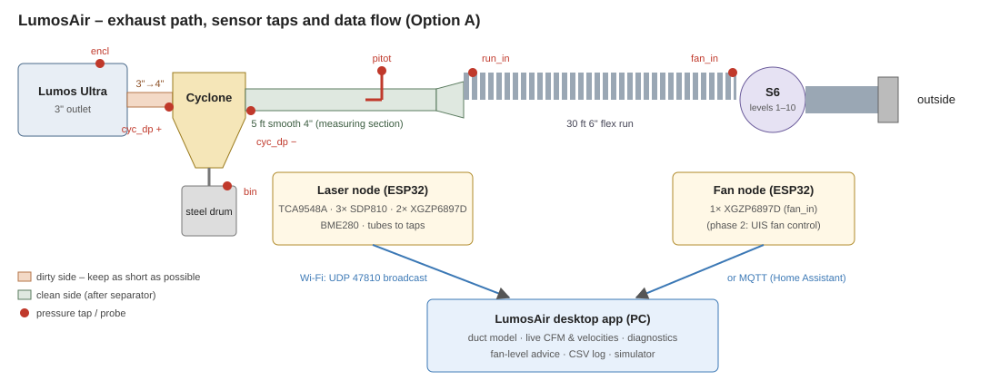

# LumosAir – Exhaust Airflow Monitor for the Lumos Ultra

*Design document, rev 1 — September 2026*

LumosAir is a low-cost, fully local system that measures airflow along the Lumos Ultra exhaust path and tells you when to raise the fan speed. It also flags a clogged duct, a leaking joint, a failing separator or a leaking dust bin. It has three parts:

1. **Sensor nodes**: two ESP32 boards with differential-pressure sensors connected to small tap holes in the duct.
2. **Transport**: UDP broadcast on the LAN (no setup), or MQTT so the readings can also go into Home Assistant.
3. **LumosAir desktop app** (.NET / WPF). It holds a physics model of the duct path, shows live CFM and air speeds, and diagnoses problems. A built-in simulator lets you test all of this before any hardware exists.



---

## 1. Key findings (read this first)

The numbers below come from the model in `app/` (`lumosair model …`). Two inputs are **estimates**: the S6 fan curve (built from AC Infinity's published 425 CFM / 503 Pa end points) and the internal resistance of the Lumos. Treat the numbers as ±25 % until the sensors are installed and calibrated. The conclusions do not change within that range.

1. **The 3" steel Dust Deputy and the CLOUDLINE S6 are not a good match.** Oneida lists a **minimum of 200 CFM** for the Heavy-Duty 3" Dust Deputy. Pushing 200 CFM through a 2-7/8" cyclone inlet takes roughly **3.4–9 inWC across the cyclone alone** (range covers typical cyclone loss coefficients K = 3–8). The S6 tops out at about **2 inWC (503 Pa) with no airflow at all**. With that cyclone installed, the model predicts **80–120 CFM** at speed 10, well below Oneida's minimum. Getting 200 CFM through that cyclone would take a shop-vac or dust-collector class blower, not an inline fan.
   ```
   lumosair model --cyc-inlet 2.875 --cyc-k 4 --need-cfm 200
   → system needs 1525 Pa (6.1 inWC); fan gives 392 Pa → NOT ENOUGH
   ```
2. **Brass is much easier to separate than wood dust, so a low-velocity cyclone can still work well.** Cyclone cut size scales with 1/√(particle density), and brass is about 8.5 g/cm³. Even at a modest ~1,600 fpm inlet speed, a cyclone with a 4" inlet has an estimated 50 % cut size near **2.6 µm for brass** (7.5 µm for wood char). The better fit is a **larger-inlet, lower-pressure-drop cyclone** that the S6 can actually drive. Manufacturers' minimum-CFM ratings are written for wood dust; the monitor measures whether your cyclone is actually working.
3. **Put nothing but a short smooth adapter between the Lumos and the cyclone.** The 3" outlet runs at roughly 2,000–2,900 fpm with the S6. That is below the ~3,500 fpm needed to keep brass airborne. The only safe amount of duct before the separator is almost none, which matches the pile of brass found inside the old 35 ft temporary hose.
4. **After the cyclone, the 6" flex run is not the bottleneck.** It costs only about 40 Pa of the fan's pressure. The Lumos 3" outlet, the 3"→4" adapter and the cyclone cost about 320 Pa. Smoothing out the 6" run gains little; the cyclone choice matters far more.
5. **Measure flow in a 4" smooth section (Option A), not in 6" (Option B).** At the same flow, a pitot tube in 4" pipe sees about 47 Pa versus about 10 Pa in 6", which gives five times the signal for the same sensor.
6. **Fan-inlet suction runs around 400 Pa**, close to the full scale of a 500 Pa sensor. Use ±1 kPa sensors for the high-suction taps (fan inlet, run start and bin) so that a clog does not push them off scale.

### Estimated operating points (Option A, generic 4" inlet cyclone, K = 6)

| S6 level | CFM | 3" outlet fpm | Cyclone inlet fpm | 4" fpm | 6" fpm | Cyclone ΔP | d50 brass | d50 wood |
|---|---|---|---|---|---|---|---|---|
| 4 | 56 | 1,143 | 643 | 643 | 286 | 36 Pa | 4.1 µm | 12.0 µm |
| 6 | 85 | 1,723 | 969 | 969 | 431 | 81 Pa | 3.3 µm | 9.8 µm |
| 8 | 113 | 2,303 | 1,295 | 1,295 | 576 | 146 Pa | 2.9 µm | 8.4 µm |
| 10 | 142 | 2,884 | 1,622 | 1,622 | 721 | 228 Pa | 2.6 µm | 7.5 µm |

The full tables are in `model-optionA.txt` and `model-optionB.txt`. For comparison, with **no cyclone** the model predicts about 200 CFM at level 10.

### Why the monitor is built before the separator

The separator is the expensive, hard-to-reverse decision, and every number that decides it (real CFM, available fan pressure, cyclone pressure drop) is currently an estimate. The sensors turn those estimates into measurements. They then stay in place to verify the separator once it is installed: cut size, bin leaks, and whether brass still reaches the long run.

Install the sensor nodes on the **current** system first (the pitot section and the fan-inlet tap are enough). Then:

- Record CFM at every S6 level.
- Replace the estimated fan curve in `system.json` with your measured one.
- Run `lumosair model --config system.json --cyc-inlet <in> --cyc-k <K> --need-cfm <x>` for each candidate cyclone.

The flow you would get with each cyclone becomes a measured-model prediction instead of a guess.

---

## 2. Physical layout

```
Lumos Ultra ─3"─► short smooth 3"→4" ─► CYCLONE ─► 5 ft smooth 4" pipe ─► 4"→6" ─► 30 ft 6" flex ─► S6 ─► 1 ft ─► wall cap
 [encl tap]                  [cyc in tap]  │  [cyc out tap]   [PITOT]          [run-start tap]    [fan-in tap]
                                           └─► sealed steel drum  [bin tap]
```

**Option A (recommended)** is shown above. **Option B** replaces the 4" pipe with 5 ft of 6" smooth pipe right after the cyclone. It saves about 12 Pa but gives a much weaker pitot signal.

Everything before the cyclone is "dirty side" and must be short, smooth, metal and bonded to ground. The fan sits on the clean side.

---

## 3. What is measured, where, and why

| Channel | Node | Sensor | + port | − port | Tells you |
|---|---|---|---|---|---|
| `cyc_dp` | laser | SDP810-500Pa | cyclone inlet wall tap | cyclone outlet wall tap | Cyclone restriction. Also a second flow meter once calibrated (ΔP ∝ Q²). |
| `bin` | laser | XGZP6897D ±1 kPa | room | tap in drum lid | **Bin leaks.** A leaking bin stops a cyclone from separating. |
| `pitot` | laser | SDP810-500Pa | pitot total port | pitot static port | Actual CFM. |
| `run_in` | laser | XGZP6897D ±1 kPa | room | 6" run start wall tap | With `fan_in`: resistance of the long run (clog, kink or leak). |
| `encl` | laser | SDP810-500Pa | room | tube into the enclosure | Fume capture: is the Lumos under negative pressure? |
| `fan_in` | fan | XGZP6897D ±1 kPa | room | fan inlet wall tap | Total suction. With the fan curve, reveals outlet-side problems. |
| `env` | laser | BME280 | – | – | Air density for accurate CFM (Spokane is about 7 % thinner than sea level). |

**Wall taps.** Drill a 1/8" hole square to the wall and **deburr the inside** (burrs cause large errors). Glue or print a small saddle with a barb, and run 3/16" ID silicone tubing to the sensor. Tubing a few feet long is fine for static pressure. Mount all laser-node sensors inside one enclosure and run tubes to them; do not run I²C wires out to the duct.

**Pitot.** Use a pitot-static probe (Prandtl type) in the 5 ft smooth 4" section, about **4 ft downstream** of the cyclone outlet (roughly 12 diameters) and about 1 ft before the 4"→6" adapter. Point it straight into the flow at the duct centreline.
- The app converts the centreline reading to mean velocity with `profileFactor` 0.9.
- **Calibrate once:** do a 6-point traverse across the duct with the same probe, then set `profileFactor` to (mean ÷ centreline).
- Pitot tips clog. The app cross-checks the pitot against the pressure taps and flags a suspect pitot automatically.

**Leaks between taps.** Seal every joint on the suction side with foil tape (a mastic seal is better). A leak lowers the reading at every downstream tap and shows up as "run losing suction".

---

## 4. Choosing the separator

Requirements derived from the model:

| Requirement | Target | Why |
|---|---|---|
| Inlet size | **4"–5" equivalent** (not 3") | Keeps cyclone ΔP within what the S6 can supply (≲ 150–250 Pa at your flow). |
| Pressure drop at 150 CFM | **< 1 inWC (250 Pa)** | The S6 makes less than 2 inWC at that flow, and about 0.8 inWC is already used by the Lumos, adapters, duct and wall cap. |
| Construction | Steel, grounded, sealed drum | Metal dust (combustible-dust practice). |
| Drum | 20–30 gal, sealed lid, tap for the `bin` sensor | Keeps the bin from leaking. |
| Verification | Measured with this system | Watch the cut size in the app and inspect the downstream duct after 25 and 50 coins. |

Candidates to evaluate (plug each into `lumosair model` with its real inlet size):
- **Oneida Heavy-Duty 3" Steel Dust Deputy** (~$400). Its 200 CFM minimum is not reachable with the S6 (see §1). It would suit a high-static-pressure blower instead.
- **Larger Oneida steel cyclones (4"/5" Super Dust Deputy class).** Oneida's FAQ describes the Super Dust Deputy as intended for systems above about 350 CFM, so ask Oneida about low-flow operation. For dense brass, the physics suggests separation can still be useful at lower speed, and the monitor will show whether it is.
- **A cyclone you design yourself (e.g. 3D printed, 4" inlet)**, sized for 120–180 CFM using the Lapple proportions in `SystemModel.CycloneCutSize`. For metal dust, use a conductive material or a metal liner and ground it.

If you want to keep the 3" steel Dust Deputy, the fan has to change: roughly **5–9 inWC at 200 CFM**, which means a dust-extractor or regenerative-blower class machine.

---

## 5. Hardware (BOM)

See `BOM.csv` for the full list. Prices are approximate as of September 2026; check before ordering.

| Item | Qty | Approx. |
|---|---|---|
| ESP32-WROOM-32 DevKit | 2 | $8–12 ea |
| Sensirion SDP810-500Pa (tube-connected, I²C) | 3 | ~$35–50 ea |
| CFSensor XGZP6897D, ±1 kPa, I²C | 3 | ~$8–15 ea |
| TCA9548A I²C multiplexer breakout | 1 | ~$5–8 |
| BME280 breakout | 1 | ~$5–10 |
| Pitot-static probe, short insertion (4" duct) | 1 | $25–80 |
| 3/16" ID silicone tubing, 10 m | 1 | ~$10 |
| Barbed tap fittings or printed saddles | 8 | ~$10 |
| 4" smooth metal pipe, 5 ft + couplers | 1 | ~$20–30 |
| Enclosures, USB 5 V supplies, Dupont/JST leads | 2 | ~$30 |
| **Total (excluding cyclone)** | | **≈ $250–400** |

**Wiring (laser node).**
- ESP32 GPIO21 (SDA) and GPIO22 (SCL) go to the TCA9548A and the BME280. Each sensor goes on its own mux port 0–4.
- Both sensor types have fixed I²C addresses (SDP810 = 0x25, XGZP = 0x6D), which is why the mux is needed.
- Use 3.3 V for all parts.
- Keep I²C leads under 30 cm. Most breakouts already carry 4.7–10 kΩ pull-ups.

**Fan node:** one XGZP6897D wired directly to GPIO21/22. Set `TCA9548A_ADDR 0` if you leave out the mux.

---

## 6. Commissioning

1. **Flash** both nodes: `pio run -e laser -t upload`, then `-e fan`. Watch the serial monitor; every channel should print `ok`.
2. **Zero**: fan off, lid closed, wait 10 s, then click **Zero sensors** in the app. Offsets are stored on each node.
3. **Fan curve** (optional but valuable): record CFM and `fan_in` at levels 1–10. Put the measured points into `fan.curveCfm` / `fan.curvePa`. The fan's pressure is about `fan_in` plus the loss downstream of the fan.
4. **Cyclone K**: at level 10, K = `cyc_dp` ÷ (½ρV²) using the cyclone inlet velocity. Enter it in `cyclone.k`.
5. **Pitot traverse**: measure across the duct and set `profileFactor`.
6. **Baseline**: with a clean duct and an empty drum, run at your normal level and click **Capture baseline**. From then on, drift is measured against this known-good state.
7. **Verify**: engrave 25 coins, weigh the drum catch, and look inside the 6" run just after the 4"→6" expansion.

---

## 7. How the diagnostics work

Every sensor reading is converted into "the flow that would explain this reading" using the healthy model, corrected by the baseline. When they all agree, the system is healthy. The first one that disagrees points to where the problem is.

| Finding | Trigger | Typical cause |
|---|---|---|
| Duct velocity too low before separator | slowest pre-separator duct < material minimum | Duct between the Lumos and the cyclone, or fan too slow |
| Cyclone too slow to separate well | estimated cut size > material target, or inlet < ~1,000 fpm | Fan level too low |
| Cyclone ΔP above / below normal | ≥ 30 % drift | Build-up / leak, clogged tap |
| Dust bin leaking | bin suction ≥ 30 % below normal | Lid or gasket |
| Long run restricted / heavily restricted | run ΔP ≥ 30 % / 60 % above normal | Deposit, kink, crushed flex |
| Long run losing suction | run ΔP ≥ 30 % below normal | Loose joint or leak |
| Pitot doesn't match other sensors | pitot ≥ 20 % off the tap consensus | Clogged pitot (app switches to the consensus) |
| Less flow than the fan should move | measured flow ≥ 20 % below the fan curve at the measured suction | Outside damper stuck, screen clogged, impeller fouled |
| Enclosure not under enough suction | < 3 Pa | Lid open, outlet disconnected |
| Fan cannot reach safe transport velocity | even level 10 isn't enough | System redesign needed |
| Node offline / sensor fault / saturated | – | Power, Wi-Fi, wiring, sensor range |

**Recommended level** is the lowest S6 level that meets every requirement: duct velocity before the separator, cyclone cut size, and cyclone minimum speed. It uses the fan laws (flow ∝ speed).

All nine simulated faults are covered by automated tests (`app/tests`). Each is detected correctly, with no false alarms on the healthy system.

---

## 8. Phase 2 ideas

- **Automatic fan speed.** The community has reverse-engineered the CLOUDLINE UIS controller port for ESP32 control. Verify the pinout with a scope before connecting anything. The app already calculates the level to set.
- **Home Assistant.** Enable MQTT in the firmware; the telemetry topics can be added as MQTT sensors, and "Jim Bob" could announce "cyclone bin leaking".
- **Downstream dust check.** A PM sensor on a small sample line after the cyclone would give a direct "is brass getting through" signal.
- **Drum weight.** A load cell under the drum would log grams captured per job.

## 9. Assumptions and limits

- The fan curve and the Lumos internal resistance are estimates until measured (see §6).
- Cyclone K and cut size use the Shepherd–Lapple and Lapple correlations. They are good for trends and ±30 % absolute.
- Sub-micron fume is not separated by any cyclone. It goes outside with the exhaust, as it does today.
- Pressure-based flow needs air moving well above about 30 CFM to be meaningful. Below that the app reports "fan off" rather than diagnosing.
