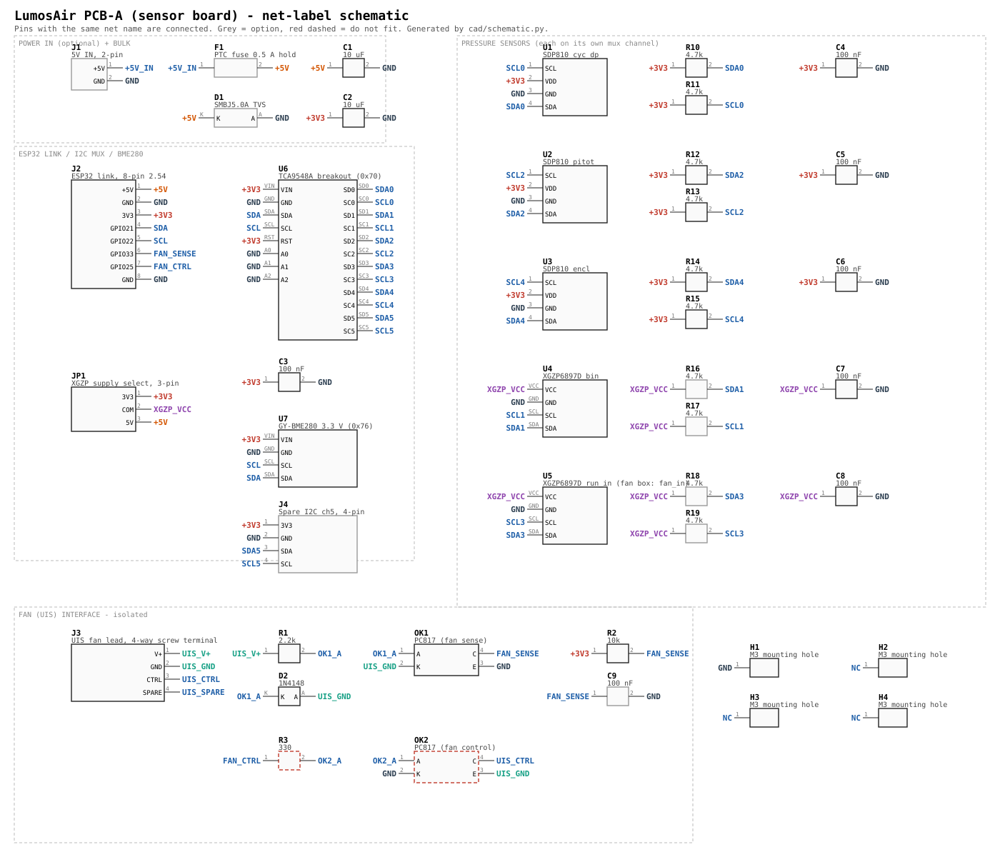

# PCB-A — the sensor board

Everything that needs a hose, plus the I²C mux, the air sensor and the fan interface,
on one board under the ESP32. Drawn to be entered in Proteus (or any EDA tool).

- **[pcb_a_schematic.svg](pcb_a_schematic.svg)** — the schematic, net-label style: pins
  with the same net name are connected.
- **[pcb_a_netlist.md](pcb_a_netlist.md)** — every net and every pin, for checking the
  layout against.

Both are generated by [`cad/schematic.py`](../../cad/schematic.py) from one parts table,
so they can't disagree. Change the table and re-run it rather than editing either file.

## Blocks

| Block | Parts | What it does |
|---|---|---|
| Link to the ESP32 | J2 (8-pin) | +5V, GND, 3V3, SDA (GPIO21), SCL (GPIO22), FAN_SENSE (GPIO33), FAN_CTRL (GPIO25) |
| I²C mux | U6 TCA9548A breakout, C3 | The pressure sensors share addresses (SDP810 = 0x25, XGZP = 0x6D), so each gets its own channel. A0–A2 low = 0x70. |
| Pressure | U1–U3 SDP810, U4–U5 XGZP6897D, R10–R19, C4–C8 | One sensor per channel, pull-ups per channel, 100 nF at every sensor. |
| Air | U7 GY-BME280 | On the main bus (0x76), not behind the mux. Density correction for CFM. |
| XGZP supply | JP1 | See below — the one thing to set when the sensors arrive. |
| Fan sense | J3, R1, D2, OK1, R2, C9 | The fan lead's own rail lights OK1, which pulls FAN_SENSE low: "this is the fan box" (DESIGN 6a, step 1). Fully isolated. |
| Fan control | R3, OK2 — **do not fit** | Footprints only, until the UIS pinout and signalling are verified. `FAN_OUTPUT_ENABLED` stays False. |
| 5 V input | J1, F1, D1, C1 | Only if power comes in on the 2-wire USB-C socket rather than through the ESP32 board's own USB port. The TVS clamps and the PTC trips if the 10 V fan lead is ever plugged into the power socket. |

## Channel map — identical on both boxes

> **Rev B (milled copper-clad board, Sept 2026) changes this map** to make the single-sided routing work: ch0 pitot, ch1 run_in (fan box: fan_in), ch2 bin, ch3 cyc_dp, ch4 encl. The XGZPs also run from 3.3 V (JP1 removed) and have port 2 on the hose (sign -1). See [cnc/README_CNC.md](cnc/README_CNC.md). The table below is the original rev A map.

| Mux ch | Part | Laser box | Fan box |
|---|---|---|---|
| 0 | U1 SDP810 | `cyc_dp` | — |
| 1 | U4 XGZP | `bin` | — |
| 2 | U2 SDP810 | `pitot` | — |
| 3 | U5 XGZP | `run_in` | **`fan_in`** |
| 4 | U3 SDP810 | `encl` | — |
| 5 | J4 (spare) | — | — |

Because both boards are the same, the fan box's `fan_in` has to sit on one of the two
XGZP positions; it takes the RUN one, channel 3. `config_fan.py` still says channel 0
from the bench days — change it to `"mux": 3` when the sensors go in.

## Things to confirm before ordering boards

1. **XGZP6897D supply voltage.** The standard part is **5 V**; the 3.3 V version has
   `33` in its part number. Read the marking on the sensor when it arrives, then set
   **JP1: 1-2 for 3.3 V, 2-3 for 5 V**. JP1 also sets the pull-up voltage on the XGZP
   channels; the TCA9548A passes each channel through at its own voltage, so the ESP32
   still only sees 3.3 V. If the module already has pull-ups, leave R16–R19 off.
2. **XGZP pressure range.** The firmware assumes the ±1 kPa part (`k = 4096`). The range
   is in the part number (`001KPD…` = 1 kPa). A different range needs a different `k`.
3. **Module footprints.** U4/U5 (XGZP modules), U6 (TCA9548A) and U7 (BME280) are
   breakouts; take the pin order and spacing from the boards you have, not from a library.
4. **SDP810 orientation.** Pin 1 is SCL, and Sensirion's table is drawn from the
   **bottom**. Mirror-check the footprint — this is the classic way to reverse a part.
5. **UIS wiring.** J3's four terminals are functions (V+, GND, CTRL, spare), not UIS
   contact numbers. Meter the fan lead first, then land each wire on its function.
   Keep UIS_GND copper apart from board GND; the optocouplers are the only bridge.

## Why these values

- **R1 2.2 k:** about 4 mA through OK1's LED from a 10 V rail, still enough at 5 V.
  D2 stops the LED being reverse-biased if the rail turns out to be the other way round.
- **R2 10 k:** GPIO33 has an internal pull-up, but an external one is predictable. With
  a PC817 (CTR ≥ 50 %) the 4 mA LED current sinks far more than the 0.33 mA R2 passes.
- **R3 330 Ω:** about 6 mA from a GPIO, well inside its limit.
- **4.7 k pull-ups** per channel: the SDP810 has none of its own, and each mux channel is
  a separate bus.
- **3V3 for the SDP810s:** they run from 2.7 to 5.5 V; 3.3 V keeps them on the ESP32's
  logic level with no translation.

## Firmware that follows from this board

- `fan_in` on channel 3 in `config_fan.py` (above).
- A `FAN_SENSE_PIN = 33` setting and the "which box am I" logic that reads it. Not
  written yet — it waits for a board to test on.

## Mounting the display

The SWIFT-LCD-20 has only two holes, both on the connector edge (30 mm apart, 2.5 mm in
from the edge — maker's dimension drawing). Nothing holds the other edge.

**Recommended: hang it from the lid.** Two nylon screws through the clear lid into two
standoffs, into the display's holes, glass facing up against the lid. A strip of 1–2 mm
foam tape between the far edge of the display board and the lid keeps it parallel.

- It reads best: no gap for parallax or reflections between the glass and the lid.
- It takes the display out of the stack, so PCB-A and the ESP32 board have the full
  height of the box.
- The six-wire lead has to reach when the lid is open; the supplied pigtail is long
  enough if it runs along a wall.
- Seal the two lid holes with nylon screws and rubber washers.

**Alternative: a printed cradle** screwed to the ESP32 board's mounting holes, with a
ledge under the far edge of the display. Better if the lid comes off often; more height
used inside the box.

Measure the hole diameter on your display before buying screws (the maker calls it
"LEGO compatible", which may mean Ø4.8 mm rather than M2.5/M3).
