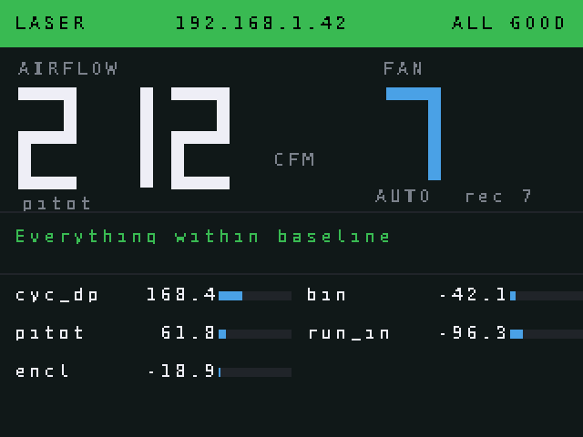
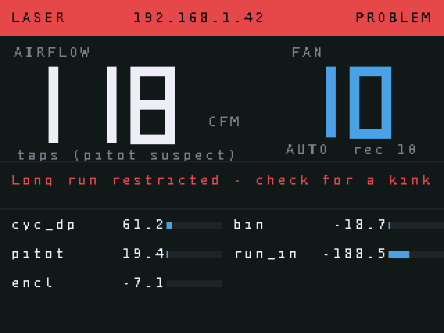

# LumosAir node firmware (MicroPython)

Runs on an ESP32-WROOM-32. Both boxes run this same code; `config.py` is the only
difference between them.

```
main.py                 entry point, runs on boot
config_example.py       copy to config.py and edit (git-ignored)
lib/lumosair/
  sensors.py            SDP8xx, XGZP6897D, BME280, TCA9548A
  st7789.py             2.0" 240x320 display driver (stripe buffer + 7-segment)
  display_ui.py         what the box screen shows
  net.py                Wi-Fi, UDP telemetry/commands/status, optional MQTT
  fan.py                fan level output (disabled until the UIS pinout is verified)
  ota.py                pull updates over Wi-Fi
  node.py               sampling loop and command handling
tools/serve_update.py   serve this folder to the nodes for OTA
tools/send_command.py   zero / set_level / update / watch telemetry from a PC
tools/simulate_node.py  run a node on the PC and render its screen to a PNG
tests/test_firmware.py  host tests (plain CPython, no hardware)
```

## Set up VS Code

1. Install the **MicroPico** extension.
2. Flash MicroPython once over USB:
   ```
   pip install esptool mpremote
   esptool --chip esp32 erase_flash
   esptool --chip esp32 write_flash -z 0x1000 ESP32_GENERIC-<version>.bin
   ```
3. Copy `config_example.py` to `config.py`, set your Wi-Fi, node id and channel map.
4. Upload:
   ```
   mpremote connect COM5 fs cp -r lib :
   mpremote connect COM5 fs cp main.py config.py :
   mpremote connect COM5 reset
   ```
   MicroPico's "Upload project to Pico" does the same from the VS Code toolbar.
5. `mpremote connect COM5 repl` shows the boot log; each channel should print `ok`.

## Updating over Wi-Fi

Once a box is mounted on the duct, don't take it down for a USB cable:

```
python tools/serve_update.py             # on the PC, in this folder
python tools/send_command.py laser update # or the Update button in the app
```

The node fetches `manifest.json`, downloads only the files whose SHA-256 changed,
writes them and reboots. Set `OTA_URL` in `config.py` to the address the tool prints.

## What the box screen shows

The 2.0" ST7789 shows both what the node measures and what the PC concludes:

- a colour status band (green / amber / orange / red) and the node name,
- the system airflow in CFM, from the PC's broadcast, with its source,
- the fan level, whether control is Auto or Manual, and the recommended level,
- the top finding in plain words ("Dust bin appears to be leaking"),
- every channel on that node in Pa, with a bar and a fault flag.

If the PC app isn't running the screen says so and keeps showing live pressures,
so the box is still useful on its own.

## Fan control

`fan.py` accepts `{"cmd":"set_level","level":7}` and reports the level in telemetry.
It only drives a pin once you set `FAN_OUTPUT_ENABLED = True` in `config.py`: the
CLOUDLINE UIS pinout is community-reverse-engineered, so check it with a meter
first. Until then the app's Auto mode still works as an advisory — it tells you
(and the box screen) which level to set.

## Running a node without a node

`tools/simulate_node.py` runs the box on your PC and draws what the panel would
show. It is not a mock of the UI: it imports the real `st7789` and `display_ui`
and decodes the SPI command stream the driver emits (CASET / RASET / RAMWR) into
a framebuffer, so the PNG is the panel pixel for pixel — layout bugs included.
Standard library only.

```
python tools/simulate_node.py --window         # a window; arrows walk the screens
python tools/simulate_node.py --live --window  # a live box, on screen
python tools/simulate_node.py                  # every scenario -> out/*.png
python tools/simulate_node.py --live           # headless; one PNG per frame
```

`--window` opens a real window (tkinter, standard library) showing the panel at
2x. Without `--live` it shows one scenario and **Left/Right** walk through all
eight, so you can flick between states and compare layouts; Esc closes it.





Scenarios: `healthy`, `clog`, `binleak`, `pitot`, `slow`, `sensorfault`, `nopc`
(the desktop app isn't running) and `fannode` (the one-channel box).

`--live` makes it a stand-in for a real box: it publishes telemetry on UDP 47810,
accepts commands on 47811, and listens for the app's status broadcast on 47812.
Start it, then run the desktop app with **Source = Udp** and **Connect** — the app
sees a node that isn't there, and the screen reacts to what the app concludes.
Add `--window` to watch it live; without it each frame is written to
`out/screen_live_<node>.png` (written to a temp file and renamed, so a preview
can never catch a half-written frame).

The 8x8 font it uses stands in for MicroPython's built-in one. The cell is the
same fixed 8x8, so anything that fits here fits on the panel; individual glyph
shapes differ slightly.

**This is how the seven-segment bug was found** — every digit with an asymmetric
shape (3, 4, 6, 7, 9) rendered mirrored, because `_DIGITS` is written LSB-first
and `seg7` was reading it MSB-first. Nothing caught it, because the old test only
asserted that `seg7` wrote *some* pixels. There are now eight checks on which
bars each digit lights.

## Host tests

```
python tests/test_firmware.py
```

39 checks covering the CRC and scaling maths, the multiplexer, channel averaging
and zero offsets, the fan level mapping, the telemetry payload the PC app parses,
and the display driver — including which segments each digit lights. Only the pin
wiggling needs hardware.
